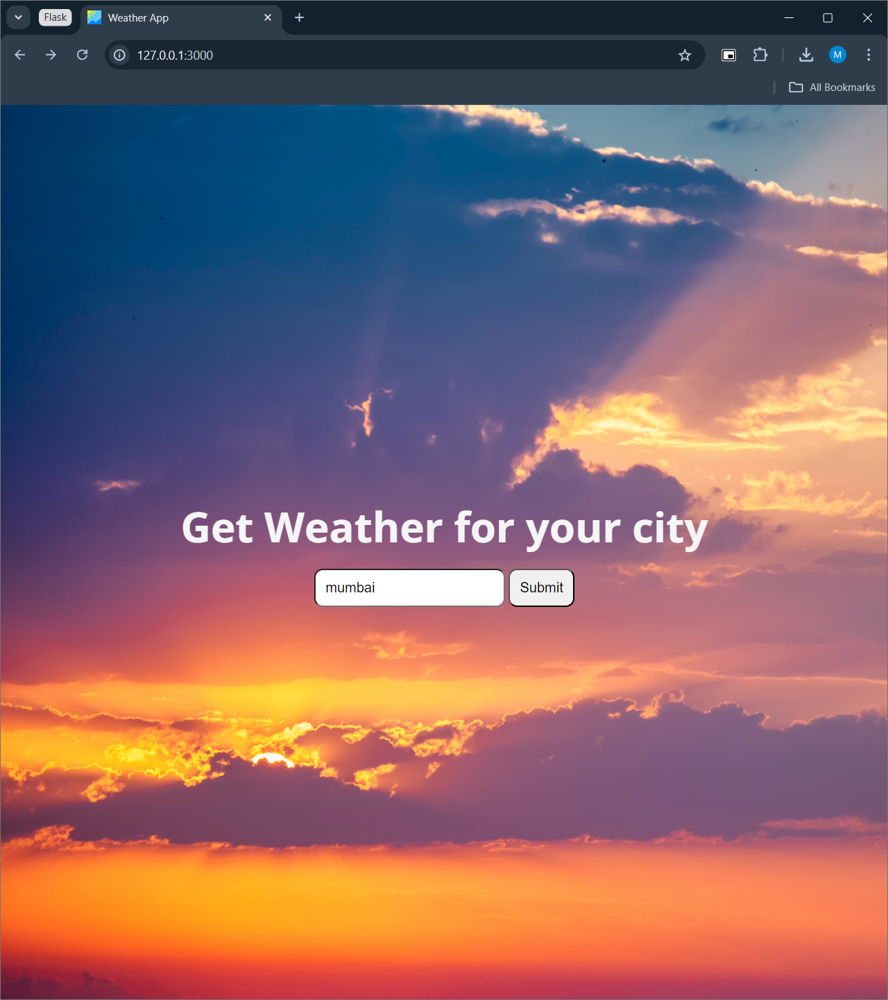
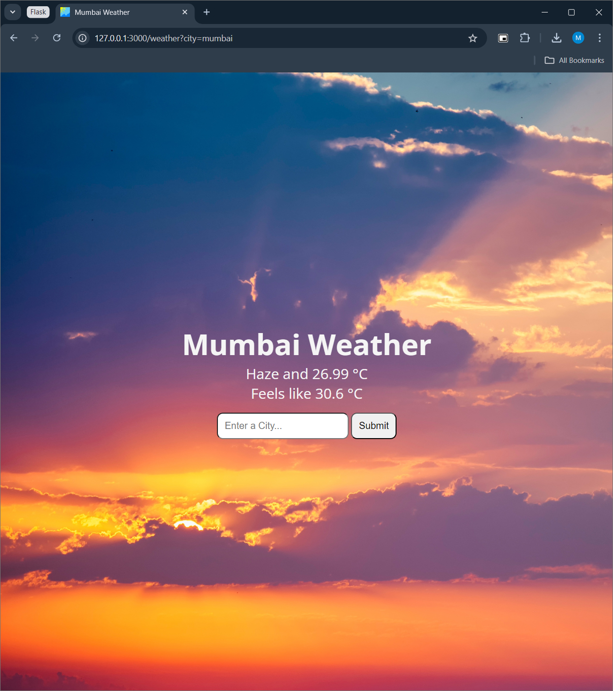

# Flask Weather App

A simple weather app that fetches weather data from openweather and displays it in a simple flask app.

## Screenshots(desktop)

Additional features like 5 day forecast, windspeed etc will be added soon.
